**V0.8 technical-closure reconciliation — 2026-10-05:** V0.8-A through V0.8-E are technically complete. PR #182 final head `1092a3b197b346f71e55671b5235aec90b536b81` passed CI #3307/#3308 and clean final DEC-022 review, squash-merged as `542b1df9ad866f9b557e06ec2ca366b6131e2f94`, and post-merge main CI #3309 passed. Stage E remains a derived read/composition layer over canonical source modules with no added schema/migration, editable KPI/report ledger, data warehouse, OLAP store, FX engine or synthetic allocation. Proxy UAT is PASS; AC-V08-039/040 were accepted by the Product / Business Owner on 2026-10-05. PR #185 merged as `920d592e7ffe01cb83b106c215fa20adb959cb95`; post-merge main CI #3394 PASS; Issue #184 is CLOSED / COMPLETED. V0.8 Management is COMPLETE + ACCEPTED. V1.0 Production / production-readiness is NEXT and requires a separate approved entry decision before implementation.

**V0.7 implementation reconciliation — 2026-10-04:** `direct_cost_postings`, `cost_forecasts` / `cost_forecast_lines` and `project_variations` are implemented through forward-only migrations with retained approval/history integrity. Stage E reporting remains a derived read model over canonical source modules and these Cost Control-owned mutation entities; it does not add an editable report ledger.

# Construction ERP — Database ERD

**Document Status:** Database Baseline v0.1  
**Current Phase:** V1.0-C Security Hardening — NEXT / NOT STARTED  
**V1.0-B technical-closure note — 2026-10-09:** Backup / Restore / Recovery is COMPLETE. The stage introduced recovery tooling and evidence only; no V1.0-B business-schema migration or destructive reverse-migration path was introduced. PR #194 merged as `3d7e6e05cafe6ed0407ce8ec2c5aca89ea196c7e`; exact-main CI #3838 PASS; Issue #193 CLOSED / COMPLETED. V1.0-C Security Hardening is NEXT / NOT STARTED.
**Architecture Baseline:** v0.1  
**Requirements Baseline:** v0.1  
**Database:** PostgreSQL  
**Application ORM:** Prisma ORM  
**Scope:** Logical database design plus implementation reconciliation; the live PostgreSQL schema is source-controlled through forward-only Prisma migrations.

**V0.6-D implementation note — 2026-10-03:** `retention_ledger_entries` is now materialized only for payable Subcontract Certification withholding evidence and linked compensating reversal evidence. Implemented entry types are `WITHHOLDING` and `REVERSAL` only; each entry is Company/Project/Agreement/Certification scoped, base-currency constrained, source actor/time bound, duplicate-protected and immutable after insert. Certification approval/reversal materializes the corresponding evidence through forward-only database triggers; historical eligible Certifications are backfilled. This does **not** authorize retention RELEASE or user ADJUSTMENT. DOC-009 continues to use canonical `documents` / `document_links`; the Stage-D forward-only scope guard adds the eight approved Finance/Subcontract targets without creating another file store.

---

# 1. Purpose

This document defines the logical database model for the Construction ERP.

It translates the approved Architecture Baseline v0.1 and Requirements Baseline v0.1 into:

- Database entities
- Primary keys
- Foreign-key relationships
- Cardinality
- Module ownership
- Audit fields
- Transaction traceability
- Record-lifecycle rules
- PostgreSQL / Prisma implementation conventions

The database model must preserve the core architecture:

Project  
→ WBS  
→ Activity

and the independent cost dimensions:

Project  
+ WBS  
+ Cost Code

WBS and Cost Code must not be modeled as a parent-child relationship.

---

# 2. Database Design Principles

## 2.1 Internal IDs

Every persistent business entity uses an internal UUID primary key:

`id uuid PRIMARY KEY`

Internal UUIDs are never replaced by user-facing document numbers.

Examples:

Internal ID:

`6a1b...`

Business Number:

`PO2609-015`

A change to document-number formatting must not change database identity or relationships.

---

## 2.2 Business Numbers

User-facing documents use separate business-number fields such as:

- project_code
- pr_number
- rfq_number
- quotation_number
- po_number
- grn_number
- issue_number
- return_number
- transfer_number
- subcontract_number
- claim_number
- supplier_invoice_number
- client_invoice_number
- payment_number
- variation_number

Business-number generation is controlled by `number_sequences`.

Uniqueness is enforced within the appropriate company/document scope.

---

## 2.3 Company Scope

The prototype operates as a single-company ERP.

A `companies` table is nevertheless retained as the owning business namespace so that company settings, numbering and data ownership do not need to be redesigned later.

This does **not** introduce multi-company user-interface scope in the prototype.

---

## 2.4 Standard Data Types

Recommended PostgreSQL types:

| Data | PostgreSQL Type |
| --- | --- |
| Internal ID | `uuid` |
| Business code / number | `varchar` |
| Short text | `varchar` |
| Long text | `text` |
| Date | `date` |
| Timestamp | `timestamptz` |
| Money | `numeric(18,2)` |
| Quantity | `numeric(18,4)` |
| Percentage | `numeric(5,2)` |
| Duration in work days | `numeric(8,2)` |
| Configuration payload | `jsonb` |

Prototype monetary values are treated in the company's base currency.

Foreign-exchange conversion and multi-currency accounting are not part of the approved v0.1 requirements baseline.

---

## 2.5 Standard Audit Columns

Primary master and transaction tables should include, where applicable:

- `created_at timestamptz`
- `created_by_user_id uuid`
- `updated_at timestamptz`
- `updated_by_user_id uuid`

Approval-controlled transaction records may additionally expose:

- submitted_at
- submitted_by_user_id
- approved_at
- approved_by_user_id
- rejected_at
- rejected_by_user_id
- cancelled_at
- cancelled_by_user_id

Detailed approval history is stored through the generic approval tables rather than relying only on header timestamps.

---

## 2.6 Deletion Strategy

Approved or posted transactions must not normally be physically deleted.

Transaction lifecycle uses states such as:

Draft  
→ Submitted  
→ Approved  
→ Rejected / Cancelled

Master data uses:

- `is_active`
- optional `archived_at`

Historical references must remain valid after a master record becomes inactive.

Hard deletion may be permitted only for unreferenced draft/setup records where explicitly allowed by service rules.

Core transaction foreign keys should default to `ON DELETE RESTRICT`.

---

## 2.7 Configurable Status vs Approval State

The database separates:

**Approval State**

A controlled workflow state such as Draft, Submitted, Approved, Rejected or Cancelled.

from:

**Operational Status**

A configurable status such as Active, Completed, On Hold, Delayed or Closed.

Configurable operational statuses are stored in `status_definitions`.

---

## 2.8 Source of Truth

Each business record has one owning module.

Other modules reference the owning record rather than copying it.

Examples:

- Customer → Master Data
- Activity → Planning & Scheduling
- Purchase Order → Procurement
- Goods Receipt → Inventory
- Payment → Finance
- Document metadata → Documents
- Budget → BOQ & Budget

---

# 3. High-Level ERD

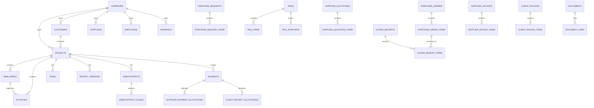

The diagrams in this document are domain views, not separate databases.

All tables reside in the same PostgreSQL database during the modular-monolith prototype.

---

# 4. Foundation, Security and Administration

## 4.1 Core Entities

| Table | Owner | Purpose |
| --- | --- | --- |
| `companies` | Administration | Company identity and base settings |
| `users` | Foundation | Application user accounts |
| `user_sessions` | Foundation | Authenticated session records where persistence is required |
| `roles` | Administration | Configurable roles |
| `permissions` | Foundation | Permission definitions |
| `user_roles` | Administration | User-to-role assignment |
| `role_permissions` | Administration | Role-to-permission assignment |
| `approval_workflows` | Foundation | Reusable approval workflow definitions |
| `approval_steps` | Foundation | Ordered workflow steps |
| `approval_step_roles` | Administration | Roles authorized for workflow steps |
| `approval_instances` | Foundation | Approval process for one business record |
| `approval_actions` | Foundation | Immutable approval decisions/history |
| `status_definitions` | Administration | Configurable operational statuses |
| `number_sequences` | Administration | Business-number generation |
| `system_settings` | Administration | Configurable company/system settings |
| `project_types` | Administration | Project classifications |
| `activity_types` | Administration | Activity classifications |
| `audit_logs` | Foundation | Immutable material-change / action log |

---

## 4.2 Security ERD

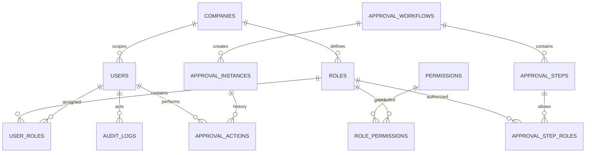

---

## 4.3 Key Foundation Columns

### `companies`

- id PK
- company_code UNIQUE
- company_name
- base_currency_code
- is_active
- standard audit columns

### `user_sessions`

- id PK
- user_id FK → users.id
- token_hash
- expires_at
- revoked_at, nullable
- last_seen_at, nullable
- created_at

Session secrets/tokens are stored only in hashed or otherwise appropriately protected form.

Audit logs must never record password hashes, session secrets or authentication tokens.

### `project_types`

- id PK
- company_id FK → companies.id
- project_type_code
- project_type_name
- is_active
- UNIQUE(company_id, project_type_code)

### `activity_types`

- id PK
- company_id FK → companies.id
- activity_type_code
- activity_type_name
- is_active
- UNIQUE(company_id, activity_type_code)

### `users`

- id PK
- company_id FK → companies.id
- employee_id FK → employees.id, nullable
- email
- password_hash
- display_name
- is_active
- last_login_at
- standard audit columns

A user may optionally correspond to an Employee.

Not every Employee must be an application User.

### `roles`

- id PK
- company_id FK → companies.id
- role_code
- role_name
- description
- is_active

### `permissions`

- id PK
- permission_code UNIQUE
- module_code
- description

Examples:

- `project.view`
- `project.edit`
- `po.create`
- `po.approve`

### `user_roles`

- id PK
- company_id FK → companies.id
- user_id FK → users.id
- role_id FK → roles.id
- UNIQUE(company_id, user_id, role_id)

### `role_permissions`

- id PK
- role_id FK → roles.id
- permission_id FK → permissions.id
- UNIQUE(role_id, permission_id)

### `approval_workflows`

- id PK
- company_id FK → companies.id
- workflow_code
- entity_type
- workflow_name
- is_active

### `approval_steps`

- id PK
- approval_workflow_id FK → approval_workflows.id
- step_no
- step_name
- required_approvals
- UNIQUE(approval_workflow_id, step_no)

### `approval_step_roles`

- id PK
- approval_step_id FK → approval_steps.id
- role_id FK → roles.id

### `approval_instances`

- id PK
- company_id FK → companies.id
- approval_workflow_id FK → approval_workflows.id
- entity_type
- entity_id
- current_step_no
- approval_state
- started_at
- completed_at

`entity_type + entity_id` is intentionally generic because approvals apply across many business tables.

Referential validity of the target entity is enforced by the NestJS service layer.

### `approval_actions`

- id PK
- approval_instance_id FK → approval_instances.id
- approval_step_id FK → approval_steps.id
- action
- action_by_user_id FK → users.id
- action_at
- comment

Approval actions are append-only.

### `status_definitions`

- id PK
- company_id FK → companies.id
- entity_type
- status_code
- status_label
- sort_order
- is_active
- UNIQUE(company_id, entity_type, status_code)

### `number_sequences`

- id PK
- company_id FK → companies.id
- entity_type
- sequence_code
- format_template
- reset_rule
- last_period_key
- next_value
- UNIQUE(company_id, sequence_code)

This table supports formats such as:

`POYYMM-###`

without using the business number as the database primary key.

### `system_settings`

- id PK
- company_id FK → companies.id
- setting_key
- setting_value jsonb
- UNIQUE(company_id, setting_key)

### `audit_logs`

- id PK
- company_id FK → companies.id
- entity_type
- entity_id
- action
- actor_user_id FK → users.id
- occurred_at
- old_values jsonb, nullable
- new_values jsonb, nullable
- correlation_id, nullable

Audit logs are append-only and are not editable by ordinary users.

---

# 5. Master Data

## 5.1 Entities

| Table | Owner | Purpose |
| --- | --- | --- |
| `customers` | Master Data | Shared customer master |
| `suppliers` | Master Data | Shared supplier master |
| `employees` | Master Data | Employee / staff master |
| `units_of_measure` | Master Data | Units used by quantities |
| `materials` | Master Data | Shared material master |

---

## 5.2 Master Data Columns

### `customers`

- id PK
- company_id FK
- customer_code
- customer_name
- registration_number, nullable
- contact_name, nullable
- email, nullable
- phone, nullable
- address, nullable
- is_active
- standard audit columns
- UNIQUE(company_id, customer_code)

### `suppliers`

- id PK
- company_id FK
- supplier_code
- supplier_name
- registration_number, nullable
- contact_name, nullable
- email, nullable
- phone, nullable
- address, nullable
- is_active
- standard audit columns
- UNIQUE(company_id, supplier_code)

### `employees`

- id PK
- company_id FK
- employee_code
- employee_name
- job_title, nullable
- email, nullable
- phone, nullable
- is_active
- standard audit columns
- UNIQUE(company_id, employee_code)

### `units_of_measure`

- id PK
- company_id FK
- uom_code
- uom_name
- decimal_places
- is_active
- UNIQUE(company_id, uom_code)

### `materials`

- id PK
- company_id FK
- material_code
- material_name
- description, nullable
- default_uom_id FK → units_of_measure.id
- material_category, nullable
- is_active
- standard audit columns
- UNIQUE(company_id, material_code)

---

# 6. Projects, WBS and Cost Codes

## 6.1 Entities

| Table | Owner | Purpose |
| --- | --- | --- |
| `projects` | Projects | Main construction project record |
| `project_members` | Projects | Employees assigned to a project |
| `project_contacts` | Projects | Project-specific external/internal contacts |
| `wbs_nodes` | WBS & Cost Codes | Hierarchical WBS |
| `cost_codes` | WBS & Cost Codes | Independent cost classification |

---

## 6.2 Core Construction ERD

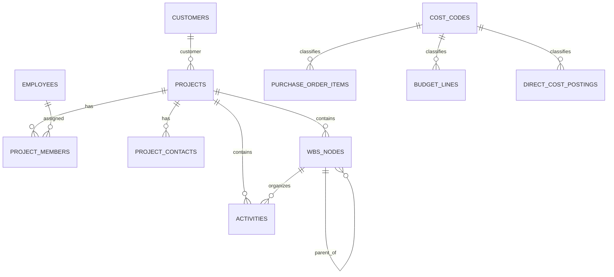

---

## 6.3 `projects`

Key columns:

- id PK
- company_id FK → companies.id
- project_code
- project_name
- project_type_id FK → project_types.id, nullable
- customer_id FK → customers.id
- status_definition_id FK → status_definitions.id, nullable
- contract_value
- location
- description
- planned_start_date
- planned_completion_date
- actual_start_date, nullable
- actual_completion_date, nullable
- standard audit columns
- is_active
- UNIQUE(company_id, project_code)

---

## 6.4 `project_members`

- id PK
- project_id FK → projects.id
- employee_id FK → employees.id
- project_role
- start_date, nullable
- end_date, nullable
- is_active
- UNIQUE(project_id, employee_id, project_role)

---

## 6.5 `project_contacts`

- id PK
- project_id FK → projects.id
- contact_name
- organization_name, nullable
- role_or_title, nullable
- email, nullable
- phone, nullable
- is_active

---

## 6.6 `wbs_nodes`

- id PK
- company_id FK
- project_id FK → projects.id
- parent_wbs_id FK → wbs_nodes.id, nullable
- wbs_code
- wbs_name
- description, nullable
- level_no
- sort_order
- is_work_package
- is_active
- standard audit columns
- UNIQUE(project_id, wbs_code)

Rules:

- Every WBS node belongs to one Project.
- A parent WBS must belong to the same Project.
- WBS depth is not hardcoded.
- WBS records referenced historically are deactivated rather than deleted.

---

## 6.7 `cost_codes`

- id PK
- company_id FK
- cost_code
- cost_name
- description, nullable
- cost_category, nullable
- is_active
- standard audit columns
- UNIQUE(company_id, cost_code)

Important:

There is **no foreign key from Cost Code to WBS**.

WBS and Cost Code remain independent dimensions.

---

# 7. Planning & Scheduling

## 7.1 Entities

| Table | Owner | Purpose |
| --- | --- | --- |
| `working_calendars` | Planning & Scheduling | Project / activity work calendar |
| `working_calendar_weekdays` | Planning & Scheduling | Standard working-week definition |
| `working_calendar_exceptions` | Planning & Scheduling | Holidays / overrides |
| `activities` | Planning & Scheduling | Canonical scheduled work entity |
| `activity_dependencies` | Planning & Scheduling | Predecessor / successor relationships |
| `schedule_baselines` | Planning & Scheduling | Approved baseline versions |
| `activity_baseline_dates` | Planning & Scheduling | Immutable activity dates per baseline |
| `activity_progress_entries` | Planning & Scheduling | Progress history |

---

## 7.2 Scheduling ERD

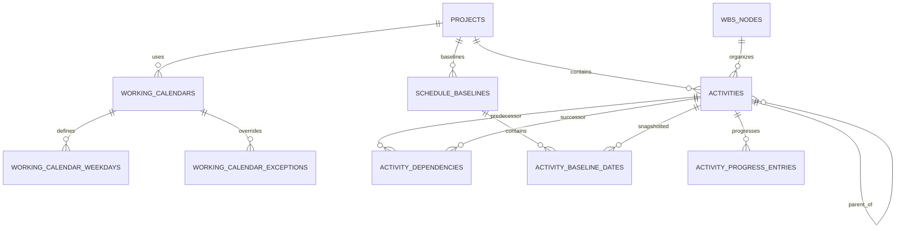

---

## 7.3 `working_calendars`

- id PK
- company_id FK
- project_id FK → projects.id, nullable
- calendar_name
- description, nullable
- timezone_name
- is_default
- is_active
- standard audit columns

A company default calendar may have no project_id.

A project-specific calendar references a Project.

---

## 7.4 `working_calendar_weekdays`

- id PK
- working_calendar_id FK → working_calendars.id
- weekday_no
- is_working
- start_time, nullable
- end_time, nullable
- UNIQUE(working_calendar_id, weekday_no)

---

## 7.5 `working_calendar_exceptions`

- id PK
- working_calendar_id FK
- exception_date
- is_working_override
- start_time, nullable
- end_time, nullable
- reason, nullable
- UNIQUE(working_calendar_id, exception_date)

---

## 7.6 `activities`

- id PK
- company_id FK
- project_id FK → projects.id
- wbs_id FK → wbs_nodes.id
- parent_activity_id FK → activities.id, nullable
- activity_type_id FK → activity_types.id, nullable
- working_calendar_id FK → working_calendars.id
- status_definition_id FK → status_definitions.id, nullable
- activity_code
- activity_name
- description, nullable
- is_summary
- is_milestone
- planned_duration_work_days
- planned_start_date
- planned_finish_date
- actual_start_date, nullable
- actual_finish_date, nullable
- forecast_start_date, nullable
- forecast_finish_date, nullable
- responsible_employee_id FK → employees.id, nullable
- owner_user_id FK → users.id, nullable
- standard audit columns
- is_active
- UNIQUE(project_id, activity_code)

Rules:

- Activity WBS must belong to the same Project.
- Summary Activities may contain child Activities.
- Milestones normally use zero duration.
- Current progress is derived from `activity_progress_entries`.
- Critical Path and float are calculated by backend scheduling logic and are not owned by Frappe Gantt.

---

## 7.7 `activity_dependencies`

- id PK
- project_id FK
- predecessor_activity_id FK → activities.id
- successor_activity_id FK → activities.id
- dependency_type
- lag_work_days
- standard audit columns
- UNIQUE(predecessor_activity_id, successor_activity_id, dependency_type)

Supported dependency types:

- FS
- SS
- FF
- SF

Service validation prevents:

- self-dependencies
- cross-project dependencies unless explicitly allowed later
- circular dependency graphs

---

## 7.8 `schedule_baselines`

- id PK
- project_id FK
- baseline_name
- version_no
- description, nullable
- approved_at
- approved_by_user_id FK → users.id
- is_current_baseline
- created_at
- created_by_user_id
- UNIQUE(project_id, version_no)

Approved baseline records are immutable.

---

## 7.9 `activity_baseline_dates`

- id PK
- schedule_baseline_id FK
- activity_id FK
- baseline_start_date
- baseline_finish_date
- baseline_duration_work_days
- UNIQUE(schedule_baseline_id, activity_id)

---

## 7.10 `activity_progress_entries`

- id PK
- activity_id FK
- daily_site_report_id FK → daily_site_reports.id, nullable
- progress_date
- percent_complete
- remarks, nullable
- entered_by_user_id FK → users.id
- created_at

Progress history is append-oriented.

A current-progress view selects the latest approved/valid entry per Activity.

---

# 8. BOQ & Budget

## 8.1 Entities

| Table | Owner | Purpose |
| --- | --- | --- |
| `boqs` | BOQ & Budget | BOQ header |
| `boq_sections` | BOQ & Budget | Hierarchical/ordered BOQ sections |
| `boq_items` | BOQ & Budget | Measurable BOQ lines |
| `budget_versions` | BOQ & Budget | Original/revised budget versions |
| `budget_lines` | BOQ & Budget | Approved budget allocation lines |

---

## 8.2 BOQ and Budget ERD

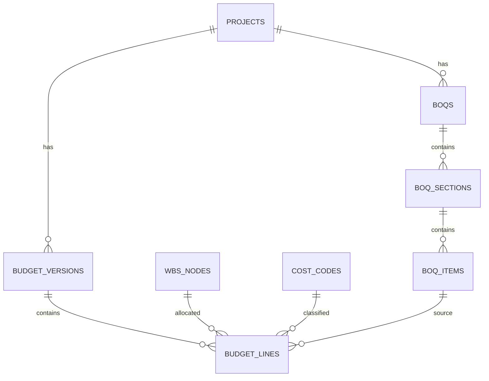

---

## 8.3 `boqs`

- id PK
- company_id FK
- project_id FK
- boq_number
- boq_name
- status_definition_id FK, nullable
- standard audit columns
- UNIQUE(project_id, boq_number)

### `boq_sections`

- id PK
- boq_id FK
- parent_section_id FK → boq_sections.id, nullable
- section_code
- section_name
- sort_order

### `boq_items`

- id PK
- boq_id FK
- boq_section_id FK
- item_code, nullable
- description
- quantity
- uom_id FK → units_of_measure.id
- rate
- amount
- wbs_id FK → wbs_nodes.id, nullable
- cost_code_id FK → cost_codes.id, nullable
- sort_order

---

## 8.4 `budget_versions`

- id PK
- company_id FK
- project_id FK
- version_no
- version_type
- description, nullable
- approval_state
- approved_at, nullable
- approved_by_user_id, nullable
- is_current
- standard audit columns
- UNIQUE(project_id, version_no)

Version types initially include:

- ORIGINAL
- REVISED

Original Budget is preserved as its own approved version.

Revised budgets create new versions and do not overwrite the original.

---

## 8.5 `budget_lines`

- id PK
- budget_version_id FK
- project_id FK
- wbs_id FK, nullable
- cost_code_id FK, nullable
- boq_item_id FK, nullable
- description
- quantity, nullable
- uom_id FK, nullable
- rate, nullable
- budget_amount
- standard audit columns

Budget reporting may aggregate independently by:

- Project
- WBS
- Cost Code
- Project + WBS
- Project + Cost Code
- Project + WBS + Cost Code

---

# 9. Site Execution

## 9.1 Implemented V0.2-E Entities

| Table | Owner | Purpose |
| --- | --- | --- |
| `daily_site_reports` | Site Execution | One Daily Site Report per Project/reporting date |
| `daily_site_report_manpower` | Site Execution | Aggregated trade/role headcount observations |
| `daily_site_report_material_usage` | Site Execution | Observational Material usage; no Inventory posting |
| `daily_site_report_progress_lines` | Site Execution | Draft report progress rows linked to immutable Activity Progress on submission |
| `daily_site_report_issues` | Site Execution | Site issue/remark observations |
| `daily_site_report_delays` | Site Execution | Explanatory delay observations |
| `daily_site_report_inspections` | Site Execution | Lightweight inspection references/remarks |
| `daily_site_report_corrections` | Site Execution | Append-only corrections to submitted reports |

Activity progress remains owned by the Scheduling module's `activity_progress` table. Equipment usage remains owned by the V0.2-F Equipment module. Site photographs remain owned by Documents and are linked to a report through `document_links`.

This prevents duplicate sources of truth.

---

## 9.2 `daily_site_reports`

- id PK
- company_id FK
- project_id FK
- report_date
- status: `DRAFT` or `SUBMITTED`
- weather_observation, nullable
- general_remarks, nullable
- created_by_user_id FK
- submitted_by_user_id FK, nullable until submission
- submitted_at, nullable until submission
- created_at / updated_at
- UNIQUE(project_id, report_date)

Rules:

- Project, creator and submitter must remain within the same Company.
- a Project/reporting date has only one canonical report.
- `DRAFT → SUBMITTED` is an operational finalization transition, not Approval Matrix workflow.
- once submitted, the report header and its draft content rows are immutable.

### `daily_site_report_manpower`

- id PK
- report_id FK
- trade_role
- headcount > 0
- remarks, nullable
- created_at

Manpower is aggregated field-resource visibility only; individual attendance and payroll are outside V0.2-E.

### `daily_site_report_material_usage`

- id PK
- report_id FK
- material_id FK
- uom_id FK
- quantity > 0
- activity_id FK, nullable
- wbs_id FK, nullable
- remarks, nullable
- created_at

Material and UOM must belong to the report Company. Activity/WBS references, when provided, must belong to the report Project. When both Activity and WBS are supplied, service validation requires the Activity to belong to that WBS.

These rows are observations only and do not create Inventory transactions or change Stock Balance.

### `daily_site_report_progress_lines`

- id PK
- report_id FK
- activity_id FK
- percent_complete between 0 and 100
- note, nullable
- activity_progress_id FK, nullable while draft and populated on submission
- created_at
- UNIQUE(report_id, activity_id)
- UNIQUE(activity_progress_id)

On report submission, each progress line appends one row to the existing immutable `activity_progress` table using the report date. The source is retained as `DAILY_SITE_REPORT` plus the report id.

### `daily_site_report_issues`

- id PK
- report_id FK
- activity_id FK, nullable
- issue_text
- remarks, nullable
- created_at

### `daily_site_report_delays`

- id PK
- report_id FK
- activity_id FK, nullable
- delay_reason
- remarks, nullable
- created_at

Delay observations provide field context only. They do not change Activity schedule dates and do not replace Stage C delay classification.

### `daily_site_report_inspections`

- id PK
- report_id FK
- activity_id FK, nullable
- inspection_reference, nullable
- remarks, nullable
- created_at

At least one of inspection reference or remarks is required. This is a lightweight V0.2 record, not a full QA/QC workflow.

### `daily_site_report_corrections`

- id PK
- report_id FK
- correction_note
- created_by_user_id FK
- created_at

Corrections may only be appended after submission. Update/delete is blocked at the database layer. Corrected Activity percentages are not stored by overwriting report rows; they append new Scheduling `activity_progress` rows with the correction id as `source_entity_id` and `DAILY_SITE_REPORT_CORRECTION` as `source_type`.

---

## 9.3 Site Documents and Equipment Boundary

Site photographs/files are stored through the existing Documents abstraction. The same Document remains Project-linked and receives an additional generic `document_links` row with:

- entity_type = `DAILY_SITE_REPORT`
- entity_id = Daily Site Report id

File bytes remain outside PostgreSQL and storage keys are not returned to normal clients.

V0.2-E intentionally creates no Equipment master or free-text Equipment field. SITE-005 becomes selectable against the canonical Equipment Register when V0.2-F is implemented.

---

# 10. Procurement

## 10.1 Entities

| Table | Owner | Purpose |
| --- | --- | --- |
| `purchase_requests` | Procurement | PR header |
| `purchase_request_items` | Procurement | PR lines |
| `rfqs` | Procurement | RFQ header |
| `rfq_items` | Procurement | Items being quoted |
| `rfq_suppliers` | Procurement | Invited suppliers |
| `supplier_quotations` | Procurement | Supplier quotation header |
| `supplier_quotation_items` | Procurement | Quotation lines |
| `quotation_awards` | Procurement | Recorded supplier-selection decision |
| `purchase_orders` | Procurement | PO header |
| `purchase_order_items` | Procurement | Current PO lines |
| `purchase_order_revision_snapshots` | Procurement | Immutable approved revision snapshots |

---

## 10.2 Procurement ERD

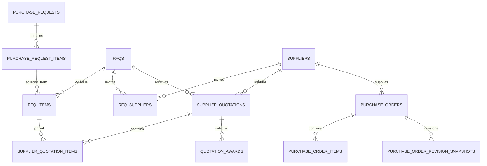

---

## 10.3 `purchase_requests`

- id PK
- company_id FK
- pr_number
- request_date
- requested_by_employee_id FK
- purpose, nullable
- approval_state
- standard audit columns
- UNIQUE(company_id, pr_number)

### `purchase_request_items`

- id PK
- purchase_request_id FK
- line_no
- project_id FK
- wbs_id FK, nullable
- cost_code_id FK, nullable
- material_id FK, nullable
- description
- quantity
- uom_id FK
- required_on_site_date, nullable
- remarks, nullable
- UNIQUE(purchase_request_id, line_no)

### V0.3-B implemented Purchase Request storage

The Stage B implementation uses the physical table name `purchase_request_lines` for the conceptual PR-item entity above. The implemented header/line shape is:

- `purchase_requests`: Company + Project owner, immutable `pr_number`, remarks, optional rejected-copy `source_request_id`, Approval Instance, creator/submitter/canceller attribution and timestamps
- `purchase_request_lines`: line number, MATERIAL/SERVICE type, optional Material (MATERIAL only), immutable Material-code snapshot for MATERIAL history, controlled description snapshot, positive quantity, UOM, optional WBS, optional independent Cost Code, optional Activity, Required-on-Site date
- submitted/rejected/approved/cancelled history is protected by database triggers from ordinary mutation/deletion
- line reference guards enforce active same-Company/same-Project ownership boundaries
- rejected-copy lineage is restricted to a rejected source PR in the same Company and Project

The conceptual `purchase_request_items` name elsewhere in this baseline should be read as this implemented `purchase_request_lines` entity until later procurement stages update their source-link names.

---

## 10.4 `rfqs`

- id PK
- company_id FK
- rfq_number
- rfq_date
- closing_date, nullable
- approval_state, nullable
- standard audit columns
- UNIQUE(company_id, rfq_number)

### `rfq_items`

- id PK
- rfq_id FK
- line_no
- purchase_request_item_id FK, nullable
- description
- quantity
- uom_id FK
- required_on_site_date, nullable
- UNIQUE(rfq_id, line_no)

### `rfq_suppliers`

- id PK
- rfq_id FK
- supplier_id FK
- invited_at, nullable
- response_status, nullable
- UNIQUE(rfq_id, supplier_id)

---

## 10.5 `supplier_quotations`

- id PK
- company_id FK
- quotation_number
- rfq_id FK
- supplier_id FK
- supplier_reference, nullable
- quotation_date
- validity_date, nullable
- total_amount
- standard audit columns
- UNIQUE(company_id, quotation_number)

### `supplier_quotation_items`

- id PK
- supplier_quotation_id FK
- rfq_item_id FK
- line_no
- quantity
- uom_id FK
- unit_price
- amount
- lead_time_days, nullable
- expected_delivery_date, nullable
- remarks, nullable
- UNIQUE(supplier_quotation_id, line_no)

### `quotation_awards`

- id PK
- rfq_id FK
- supplier_quotation_id FK
- selected_by_user_id FK
- selected_at
- decision_reason, nullable
- is_final

Quotation comparison itself is generated from RFQ + quotation data.

It does not require a duplicate comparison-data table.

### V0.3-C implemented RFQ / quotation storage

The Stage C implementation maps the conceptual sourcing entities to the following physical tables:

- `rfqs`: Company + Project owner, immutable `rfq_number`, RFQ/closing dates, remarks and creator attribution
- `rfq_lines`: immutable source lines with direct `purchase_request_line_id`, MATERIAL/SERVICE identity, description/material/UOM snapshots, requested quantity and Required-on-Site
- `rfq_suppliers`: immutable invited-Supplier links with invitation-time Supplier code/name snapshots
- `supplier_quotations`: one current quotation per RFQ/Supplier, storing Supplier reference, quotation/validity dates, remarks and creator/updater attribution
- `supplier_quotation_lines`: canonical quoted quantity, UOM snapshot, unit price, derived amount and remarks tied directly to one RFQ line
- `quotation_awards`: immutable line-level award tied to the exact quotation line with Supplier/commercial snapshots, decision reason, selector and timestamp

V0.3-C deliberately does **not** persist a system-generated Supplier Quotation number or a separate editable quotation-comparison table. Comparison and quotation totals are derived from canonical quotation lines.

Database guards enforce same-Company/same-Project source integrity, active APPROVED PR demand, invited Supplier requirements, quotation-line/RFQ-line consistency, derived amount integrity, freeze of awarded quotation lines, immutable award history, and aggregate awarded quantity not exceeding approved PR demand. Supplier Award identity is validated against the immutable RFQ invitation snapshot so later Supplier-master renames do not rewrite or block historical sourcing decisions.

---

## 10.6 `purchase_orders`

V0.3-D implements PO version history as retained Purchase Order revision rows rather than a mutable current header plus a separate JSON snapshot ledger.

Key columns:

- id PK
- company_id FK
- project_id FK
- supplier_id FK
- po_number
- revision_no
- previous_revision_id FK to `purchase_orders`, nullable for revision 0
- revision_reason, nullable
- remarks, nullable
- approval_instance_id FK, nullable
- created_by_user_id FK
- submitted_by_user_id / submitted_at, nullable until submission
- cancelled_by_user_id / cancelled_at / cancellation_reason, nullable until cancellation
- created_at / updated_at
- UNIQUE(company_id, po_number, revision_no)
- UNIQUE(previous_revision_id)
- UNIQUE(approval_instance_id)

The Company-scoped `po_number` is stable across the revision chain. Revision 0 has no predecessor. Revision N must point to the immediately preceding active APPROVED or retained REJECTED revision with the same Company, Project, Supplier and PO number. A rejected revision is an immutable retry source, not a current commitment. Earlier approved revisions remain immutable retained commercial evidence.

### `purchase_order_lines`

Key columns:

- id PK
- purchase_order_id FK
- line_no
- quotation_award_id FK
- purchase_request_line_id FK
- rfq_id FK
- rfq_line_id FK
- supplier_quotation_id FK
- supplier_quotation_line_id FK
- line_type
- material_id FK, nullable for SERVICE
- material_code_snapshot, nullable for SERVICE
- description
- quantity
- uom_id FK
- uom_code_snapshot
- unit_price
- amount
- wbs_id FK, nullable
- cost_code_id FK, nullable
- required_on_site, nullable
- expected_delivery, nullable
- remarks, nullable
- created_at / updated_at
- UNIQUE(purchase_order_id, line_no)
- UNIQUE(purchase_order_id, quotation_award_id)

Each line retains the full PR → RFQ → Supplier Quotation → Supplier Award source chain. Initial source identity and item/UOM snapshots must match the selected award and source PR line. Source identity remains immutable through later PO revisions.

Database guards enforce:

- one Company / Project / Supplier scope per PO revision
- same-Project WBS and same-Company Cost Code / Material / UOM references
- exact selected-award source traceability
- an award cannot be assigned to a different PO number
- positive quantity and quantity not exceeding the selected Supplier Award quantity
- `amount = quantity × unit_price`
- Draft-only direct line mutation/deletion
- submitted/cancelled PO history immutability
- retained cancellation actor/time/reason
- valid sequential revision chain from an active approved or retained rejected prior revision
- no physical deletion of Purchase Order history after lifecycle progression

Required-on-Site and Expected Delivery are retained procurement line dates only. They do not update Scheduling-owned Activity dates.

V0.3-D does **not** create the V0.7 Committed Cost ledger/read model, Actual Cost, Goods Receipt/stock transactions or Finance postings. Later releases may derive those measures from approved PO history without changing Stage D ownership.

---

# 11. Inventory

## 11.1 Entities

| Table | Owner | Purpose |
| --- | --- | --- |
| `warehouses` | Inventory | Stock locations |
| `goods_receipts` | Inventory | Goods-receipt header |
| `goods_receipt_items` | Inventory | Received PO lines |
| `stock_transactions` | Inventory | Immutable stock ledger |
| `material_reservations` | Inventory | Reserved available stock |
| `material_issues` | Inventory | Material-issue header |
| `material_issue_items` | Inventory | Material-issue lines |
| `material_returns` | Inventory | Return header |
| `material_return_items` | Inventory | Return lines |
| `stock_transfers` | Inventory | Warehouse-transfer header |
| `stock_transfer_items` | Inventory | Transfer lines |

Stock balance is derived from `stock_transactions`.

There is no manually editable stock-balance table.

---

## 11.2 Inventory ERD

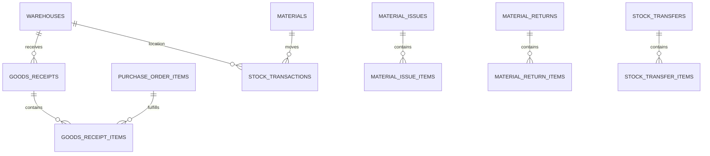

---

## 11.3 `warehouses`

- id PK
- company_id FK
- warehouse_code
- warehouse_name
- project_id FK, nullable
- location, nullable
- is_site_warehouse
- is_active
- UNIQUE(company_id, warehouse_code)

---

## 11.4 `goods_receipts`

- id PK
- company_id FK
- grn_number
- supplier_id FK
- warehouse_id FK
- receipt_date
- received_by_employee_id FK, nullable
- status
- standard audit columns
- UNIQUE(company_id, grn_number)

### `goods_receipt_items`

- id PK
- goods_receipt_id FK
- line_no
- purchase_order_item_id FK
- material_id FK
- quantity_received
- uom_id FK
- remarks, nullable
- UNIQUE(goods_receipt_id, line_no)

Multiple Goods Receipt lines may reference the same PO item over time, allowing partial receipt structurally.

Business rules for over-receipt tolerance remain an open detailed-design decision.

---

## 11.5 `material_reservations`

- id PK
- company_id FK
- warehouse_id FK
- material_id FK
- project_id FK
- wbs_id FK, nullable
- activity_id FK, nullable
- quantity_reserved
- required_date, nullable
- status
- standard audit columns

Reservation does not change physical stock on hand.

---

## 11.6 Material Issue / Return / Transfer

### `material_issues`

- id PK
- company_id FK
- issue_number
- warehouse_id FK
- project_id FK
- issue_date
- issued_to_employee_id FK, nullable
- status
- standard audit columns

### `material_issue_items`

- id PK
- material_issue_id FK
- line_no
- material_id FK
- quantity
- uom_id FK
- wbs_id FK, nullable
- cost_code_id FK, nullable
- activity_id FK, nullable
- UNIQUE(material_issue_id, line_no)

### `material_returns`

- id PK
- company_id FK
- return_number
- warehouse_id FK
- project_id FK
- return_date
- status
- standard audit columns

### `material_return_items`

- id PK
- material_return_id FK
- line_no
- material_id FK
- quantity
- uom_id FK
- original_material_issue_item_id FK, nullable
- UNIQUE(material_return_id, line_no)

### `stock_transfers`

- id PK
- company_id FK
- transfer_number
- source_warehouse_id FK
- destination_warehouse_id FK
- transfer_date
- status
- standard audit columns

### `stock_transfer_items`

- id PK
- stock_transfer_id FK
- line_no
- material_id FK
- quantity
- uom_id FK
- UNIQUE(stock_transfer_id, line_no)

---

## 11.7 `stock_transactions`

- id PK
- company_id FK
- material_id FK
- warehouse_id FK
- transaction_date
- transaction_type
- quantity_delta
- uom_id FK
- project_id FK, nullable
- wbs_id FK, nullable
- cost_code_id FK, nullable
- goods_receipt_item_id FK, nullable
- material_issue_item_id FK, nullable
- material_return_item_id FK, nullable
- stock_transfer_item_id FK, nullable
- created_at
- created_by_user_id

The stock ledger is append-only after posting.

A source transaction may generate one or more ledger rows.

Stock-transfer items generate:

- negative movement at the source warehouse
- positive movement at the destination warehouse

---

# 12. Equipment

## 12.1 Entities

| Table | Owner | Purpose |
| --- | --- | --- |
| `equipment` | Equipment | Equipment register |
| `equipment_assignments` | Equipment | Project assignment history |
| `equipment_usage` | Equipment | Usage and optional cost allocation |
| `equipment_maintenance` | Equipment | Maintenance history |

---

## 12.2 `equipment`

- id PK
- company_id FK
- equipment_code
- equipment_name
- equipment_type
- status_definition_id FK, nullable
- ownership_type, nullable
- is_active
- standard audit columns
- UNIQUE(company_id, equipment_code)

### `equipment_assignments`

- id PK
- equipment_id FK
- project_id FK
- assigned_from
- assigned_to, nullable
- assigned_by_user_id FK
- remarks, nullable

### `equipment_usage`

- id PK
- equipment_id FK
- project_id FK
- wbs_id FK, nullable
- cost_code_id FK, nullable
- activity_id FK, nullable
- daily_site_report_id FK, nullable
- usage_date
- usage_hours, nullable
- usage_quantity, nullable
- cost_amount, nullable
- remarks, nullable
- standard audit columns

Equipment cost may flow into Cost Control only when a valid cost amount and allocation are approved according to later business rules.

### `equipment_maintenance`

- id PK
- equipment_id FK
- maintenance_date
- maintenance_type
- description
- cost_amount, nullable
- completed_at, nullable
- standard audit columns

Equipment maintenance is marked Future in the requirements baseline but the entity is reserved in the logical model to avoid equipment-history redesign.

---

# 13. Subcontracts

## 13.1 Entities

| Table | Owner | Purpose |
| --- | --- | --- |
| `subcontractors` | Subcontracts | Subcontractor register |
| `subcontracts` | Subcontracts | Subcontract agreement |
| `subcontract_work_orders` | Subcontracts | Work-order commitments |
| `subcontract_claims` | Subcontracts | Submitted progress claims |
| `subcontract_claim_items` | Subcontracts | Claim lines |
| `subcontract_certifications` | Subcontracts | Assessed/certified claim value |
| `subcontract_variations` | Subcontracts | Subcontract variation orders |

---

## 13.2 Subcontract ERD

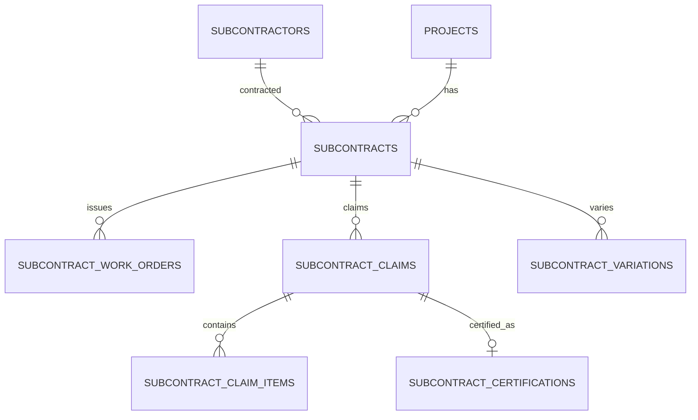

---

## 13.3 `subcontractors`

- id PK
- company_id FK
- subcontractor_code
- subcontractor_name
- registration_number, nullable
- contact_name, nullable
- email, nullable
- phone, nullable
- address, nullable
- is_active
- standard audit columns
- UNIQUE(company_id, subcontractor_code)

### `subcontracts`

- id PK
- company_id FK
- subcontract_number
- project_id FK
- subcontractor_id FK
- agreement_date
- scope_of_work
- original_value
- status_definition_id FK, nullable
- approval_state
- standard audit columns
- UNIQUE(company_id, subcontract_number)

### `subcontract_work_orders`

- id PK
- subcontract_id FK
- work_order_number
- wbs_id FK, nullable
- cost_code_id FK, nullable
- description
- amount
- approval_state
- standard audit columns
- UNIQUE(subcontract_id, work_order_number)

Approved subcontract / work-order commitments feed Committed Cost.

### `subcontract_claims`

- id PK
- company_id FK
- claim_number
- subcontract_id FK
- claim_period_start
- claim_period_end
- claim_date
- claimed_amount
- approval_state
- standard audit columns
- UNIQUE(company_id, claim_number)

### `subcontract_claim_items`

- id PK
- subcontract_claim_id FK
- line_no
- subcontract_work_order_id FK, nullable
- description
- claimed_amount
- UNIQUE(subcontract_claim_id, line_no)

### `subcontract_certifications`

- id PK
- subcontract_claim_id FK UNIQUE
- assessed_amount
- certified_amount
- retention_amount
- net_certified_amount
- certification_date
- approved_by_user_id FK
- approval_state
- standard audit columns

Certified value may become Actual Cost according to the approved cost-recognition policy.

### `subcontract_variations`

- id PK
- company_id FK
- variation_number
- subcontract_id FK
- description
- variation_amount
- approval_state
- approved_at, nullable
- standard audit columns
- UNIQUE(company_id, variation_number)

Retention-release business rules remain an open detailed-design item and are not invented in this baseline.

---

# 14. Finance

## 14.1 Entities

| Table | Owner | Purpose |
| --- | --- | --- |
| `supplier_invoices` | Finance | Supplier invoice header |
| `supplier_invoice_items` | Finance | Supplier invoice lines |
| `client_invoices` | Finance | Client invoice header |
| `client_invoice_items` | Finance | Client invoice lines |
| `payments` | Finance | Inbound/outbound payment header |
| `supplier_payment_allocations` | Finance | Outbound payment allocation to supplier invoices |
| `client_receipt_allocations` | Finance | Inbound receipt allocation to client invoices |
| `subcontract_payment_allocations` | Finance | Payment allocation to certified subcontract claims |
| `retention_ledger_entries` | Finance | Retention withheld / released / adjusted |

AP and AR balances are derived from invoice and payment-allocation data.

They are not maintained as manually editable balance tables.

---

## 14.2 Finance ERD

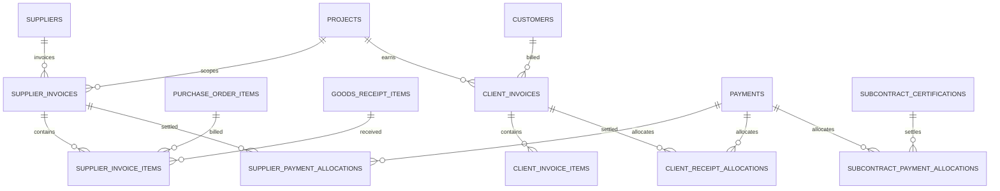

---

## 14.3 `supplier_invoices`

- id PK
- company_id FK
- project_id FK
- supplier_invoice_number
- supplier_id FK
- supplier_reference
- invoice_date
- due_date, nullable
- total_amount
- approval_state
- standard audit columns
- UNIQUE(company_id, supplier_id, supplier_reference)

### `supplier_invoice_items`

- id PK
- supplier_invoice_id FK
- line_no
- purchase_order_item_id FK, nullable
- goods_receipt_item_id FK, nullable
- project_id FK
- wbs_id FK, nullable
- cost_code_id FK, nullable
- description
- quantity, nullable
- uom_id FK, nullable
- unit_price, nullable
- amount
- UNIQUE(supplier_invoice_id, line_no)

Supplier-invoice matching tolerances are an open business-rule decision.

The schema retains the PO and GRN references required for future matching rules.

Under approved D06-17 / DEC-018, one Supplier Invoice belongs to exactly one Project. `supplier_invoices.project_id` is required; every Supplier Invoice item `project_id` and any linked PO/GR source must resolve to that same Project. Cross-Project Supplier Invoices are rejected.

Only approved Supplier Invoices are eligible for approved cost-recognition workflows.

---

## 14.4 `client_invoices`

- id PK
- company_id FK
- client_invoice_number
- project_id FK
- customer_id FK
- invoice_date
- due_date, nullable
- total_amount
- approval_state
- standard audit columns
- UNIQUE(company_id, client_invoice_number)

### `client_invoice_items`

- id PK
- client_invoice_id FK
- line_no
- wbs_id FK, nullable
- description
- amount
- UNIQUE(client_invoice_id, line_no)

Detailed progress-billing methodology remains a later business-design decision.

---

## 14.5 `payments`

- id PK
- company_id FK
- project_id FK
- payment_number
- payment_direction
- payment_date
- supplier_id FK, nullable
- customer_id FK, nullable
- subcontractor_id FK, nullable
- amount
- payment_method, nullable
- reference, nullable
- approval_state
- standard audit columns
- UNIQUE(company_id, payment_number)

Payment directions:

- OUTBOUND
- INBOUND

Service/database validation must ensure valid counterparty usage for the selected payment direction.

Under approved D06-18 / DEC-019, one Payment belongs to exactly one Project. `payments.project_id` is required, and every Supplier Invoice, Client Invoice or Subcontract Certification allocation from that Payment must resolve to the same Project. Multi-target allocations remain allowed within that Project only. Cross-Project and Company-level/non-project Payments are rejected in initial V0.6.

Only approved payments feed Paid Cost / settlement reporting.

---

## 14.6 Payment Allocation Tables

### `supplier_payment_allocations`

- id PK
- payment_id FK
- supplier_invoice_id FK
- allocated_amount
- UNIQUE(payment_id, supplier_invoice_id)

### `client_receipt_allocations`

- id PK
- payment_id FK
- client_invoice_id FK
- allocated_amount
- UNIQUE(payment_id, client_invoice_id)

### `subcontract_payment_allocations`

- id PK
- payment_id FK
- subcontract_certification_id FK
- allocated_amount
- UNIQUE(payment_id, subcontract_certification_id)

Payment allocation tables provide settlement traceability without polymorphic foreign keys. Allocation creation must enforce same-Company and same-Project integrity with `payments.project_id` before any settlement effect is committed.

---

## 14.7 `retention_ledger_entries`

- id PK
- company_id FK
- project_id FK
- retention_direction
- entry_type
- entry_date
- subcontract_certification_id FK, nullable
- client_invoice_id FK, nullable
- amount
- source_reference, nullable
- standard audit columns

Initial retention directions:

- PAYABLE
- RECEIVABLE

Initial entry types:

- WITHHOLD
- RELEASE
- ADJUSTMENT

Subcontract certification may generate retention-withheld entries.

Detailed retention-release rules remain an open business-rule decision; the ledger provides the accounting structure without inventing release authorization rules.

Finance retention reporting is derived from approved retention ledger entries.

---

# 15. Cost Control

Cost Control intentionally consumes source transactions instead of duplicating them into manually maintained totals.

## 15.1 Base Cost Sources

| Cost Measure | Primary Source |
| --- | --- |
| Original Budget | Approved ORIGINAL budget_version + budget_lines |
| Revised Budget | Current approved REVISED budget_version + budget_lines |
| Committed Cost | Approved PO items + approved subcontract/work-order commitments |
| Actual Cost | Approved Supplier Invoice items + certified subcontract claims + approved direct cost postings according to policy |
| Paid Cost | Approved Finance payments / allocations |
| Forecast Cost | Actual + remaining commitments + forecast cost-to-complete |
| Cost to Complete | Cost forecast lines |
| Project Revenue | Project contract value + approved project variations + client billing / receipts as applicable |

---

## 15.2 Cost Control Entities

| Table | Owner | Purpose |
| --- | --- | --- |
| `direct_cost_postings` | Cost Control | Approved direct costs not sourced from AP/subcontracts |
| `cost_forecasts` | Cost Control | Versioned project forecast |
| `cost_forecast_lines` | Cost Control | Forecast cost-to-complete by dimensions |
| `project_variations` | Cost Control | Client/project commercial variations affecting contract value |

---

## 15.3 `direct_cost_postings`

- id PK
- company_id FK
- project_id FK
- wbs_id FK, nullable
- cost_code_id FK
- posting_date
- description
- amount
- approval_state
- standard audit columns

Only approved postings feed Actual Cost.

---

## 15.4 `cost_forecasts`

- id PK
- company_id FK
- project_id FK
- forecast_date
- version_no
- description, nullable
- approval_state
- is_current
- standard audit columns
- UNIQUE(project_id, version_no)

### `cost_forecast_lines`

- id PK
- cost_forecast_id FK
- project_id FK
- wbs_id FK, nullable
- cost_code_id FK, nullable
- forecast_cost_to_complete
- remarks, nullable

Forecast Cost is derived from:

Actual Cost  
+ Remaining Commitments  
+ Forecast Cost to Complete

according to the approved calculation policy.

---

## 15.5 `project_variations`

- id PK
- company_id FK
- project_id FK
- variation_number
- description
- variation_amount
- approval_state
- approved_at, nullable
- standard audit columns
- UNIQUE(project_id, variation_number)

This entity provides the approved variation-value source required for revised contract value / project revenue reporting.

The V0.7-D client/project Variation workflow is implemented: Draft → submit → configured maker-checker approve/reject, immutable terminal history, and linked compensating reversal correction. Only approved non-reversed Variation effects change Revised Contract Value.

---

# 16. Documents

## 16.1 Entities

| Table | Owner | Purpose |
| --- | --- | --- |
| `document_types` | Documents | Configurable document categories |
| `documents` | Documents | File metadata |
| `document_links` | Documents | Links files to ERP records |

Actual file bytes are stored outside PostgreSQL.

---

## 16.2 `document_types`

- id PK
- company_id FK
- document_type_code
- document_type_name
- is_active
- standard audit columns
- UNIQUE(company_id, document_type_code)

Examples may include:

- CONTRACT
- DRAWING
- BOQ
- SHOP_DRAWING
- RFI
- METHOD_STATEMENT
- SITE_INSTRUCTION
- VARIATION
- INSPECTION
- SITE_PHOTO
- REPORT
- HANDOVER

Document types are configurable data, not hardcoded application-only labels.

---

## 16.3 `documents`

- id PK
- company_id FK
- document_type_id FK → document_types.id
- file_name
- storage_provider
- storage_key
- mime_type
- file_size_bytes, nullable
- uploaded_by_user_id FK
- uploaded_at
- checksum, nullable
- is_active

Prototype:

`storage_provider = LOCAL`

The business modules use a storage service abstraction.

They do not directly read/write local filesystem paths.

---

## 16.4 `document_links`

- id PK
- document_id FK → documents.id
- entity_type
- entity_id
- linked_at
- linked_by_user_id FK
- UNIQUE(document_id, entity_type, entity_id)

The generic link is intentional because Documents can attach to many module entities.

Target-record validity is enforced by the application service layer.

This avoids adding dozens of nullable foreign-key columns to `documents`.

---

# 17. Reporting / Derived Database Views

Reporting does not own duplicate transaction tables.

Where useful, PostgreSQL views or application queries may expose derived data.

Candidate views include:

| View | Purpose |
| --- | --- |
| `vw_activity_current_progress` | Latest Activity progress |
| `vw_stock_balance` | Stock by material / warehouse / project |
| `vw_ap_outstanding` | Supplier invoice outstanding balances |
| `vw_ar_outstanding` | Client invoice outstanding balances |
| `vw_procurement_schedule_risk` | Required-on-Site vs Expected Delivery |
| `vw_project_cash_flow` | Project inflows / outflows |
| `vw_project_cost_control` | Budget / committed / actual / paid / forecast / variance |

These are derived read models.

V0.3-E implements procurement schedule/risk as an application-level derived read model rather than a new persisted table or editable schedule ledger. It joins canonical PR/RFQ/quotation/award/PO references, line-level Required-on-Site and Expected Delivery dates, and derives `AT_RISK` / `ON_TIME` / `UNAVAILABLE` at read time.

Procurement document associations remain ordinary `document_links` rows with Project-owned authorization and validated procurement target IDs; no procurement-specific document table or storage silo is introduced.

They do not replace source transactions.

Prisma or NestJS may query them directly or reproduce the equivalent logic at application level depending on implementation support.

---

# 18. Transaction Traceability

The ERP must preserve source-document relationships.

## 18.1 Procure-to-Pay

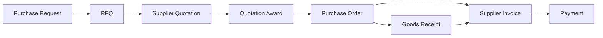

Traceability is implemented through explicit foreign keys at line level wherever possible.

Examples:

- rfq_items → purchase_request_items
- supplier_quotation_items → rfq_items
- purchase_order_items → source quotation / PR lines
- goods_receipt_items → purchase_order_items
- supplier_invoice_items → PO and GRN lines
- supplier_payment_allocations → supplier invoices

---

## 18.2 Subcontract-to-Payment

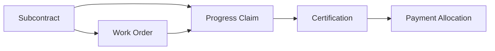

---

## 18.3 Equipment Deployment and Usage

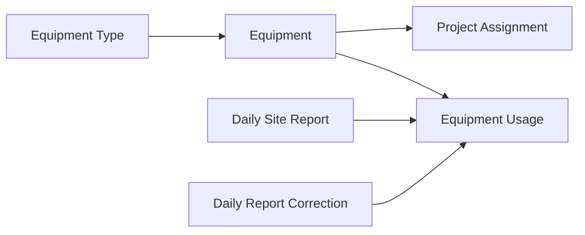

`equipment_types` and `equipment` are Company-owned source records. `equipment_assignments` retains dated Project deployment history and allows at most one open assignment per Equipment item. Availability is derived from Equipment active state, operational status and the effective assignment at the requested as-of date; it is not stored as a second source of truth.

`equipment_usage` is the canonical usage history for manual usage and Daily Site Report-origin usage. Daily Site Report draft lines are stored in `daily_site_report_equipment_usage`; submission links each line to its canonical Equipment Usage row. Submitted-report corrections append additional `equipment_usage` history with correction source traceability.

---

## 18.4 Document Target Traceability

The Documents module remains the single owner of document metadata and file storage. Generic `document_links` provides Project, WBS, Activity and Daily Site Report references without copying file bytes or creating module-specific document tables.

Rules enforced in V0.2 release closure:

- the Document and linking User belong to the same Company;
- the target entity exists and belongs to the same Company;
- WBS, Activity and Daily Site Report target links require an existing Project link for the same target Project;
- WBS and Activity target APIs enforce effective Project scope;
- storage keys remain server-only and target-specific reads/downloads use the same secure Project document path.

Operational reporting does not add persistent reporting tables in V0.2. The Project Engineer dashboard is derived at read time from Project, Scheduling, Site Execution and Equipment source records.

---

## 18.5 BOQ and Budget Revision History

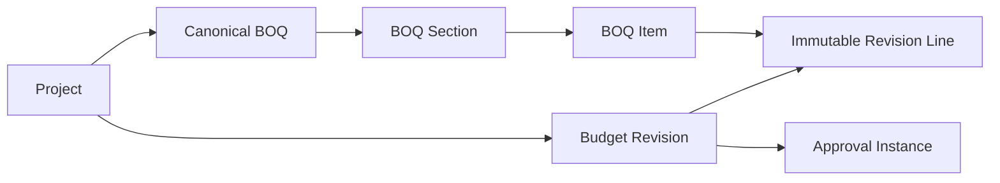

V0.3-A stores one canonical working BOQ per Project. Sections and Items retain stable identities. BOQ Item quantity, rate and amount are decimal commercial values; PostgreSQL checks and trigger logic enforce positive quantity, non-negative rate and `amount = round(quantity × rate, 4)`.

BOQ Item Project context comes from the BOQ. Optional WBS and Cost Code remain independent allocation dimensions. Database guards require WBS to belong to the same Project and UOM/Cost Code to belong to the same Company.

A Budget Revision starts as a Draft immutable snapshot of all active BOQ Items under active Sections. Snapshot lines copy the commercial fields and human-readable WBS/Cost Code/UOM labels needed to preserve historical meaning even when working master/BOQ data changes later.

Draft creation assigns an immutable Company-unique business number from Number Sequence `BUDGET_REVISION`. Submission is a separate transition that adds the Approval Instance plus submitter/time. PostgreSQL allows only that controlled Draft-to-Submitted header mutation; revision lines cannot be updated or deleted, and Budget Revision history cannot be physically deleted.

The first approved revision is Original Budget. The latest approved revision is Current Revised Budget. Rejected revisions remain history. No separate mutable Original/Revised totals are stored; Project/WBS/Cost Code reporting is derived from approved snapshot lines.

---

# 19. Key Cardinality Rules

| Relationship | Cardinality |
| --- | --- |
| Company → Projects | 1 : many |
| Customer → Projects | 1 : many |
| Project → WBS | 1 : many |
| WBS → Child WBS | 1 : many |
| Project → Activities | 1 : many |
| WBS → Activities | 1 : many |
| Activity → Child Activity | 1 : many |
| Activity → Dependencies | many : many through activity_dependencies |
| Project → Schedule Baselines | 1 : many |
| Baseline → Activity Baseline Dates | 1 : many |
| Activity → Progress Entries | 1 : many |
| Project → Daily Site Reports | 1 : many |
| Daily Site Report → Manpower / Material / Equipment / Progress / Issue / Delay / Inspection rows | 1 : many |
| Company → Equipment Types / Equipment | 1 : many |
| Equipment → Project Assignments | 1 : many |
| Equipment → Usage History | 1 : many |
| Project → Equipment Assignments / Usage | 1 : many |
| Daily Site Report → Corrections | 1 : many |
| Project → BOQ | 1 : zero-or-one |
| BOQ → Sections | 1 : many |
| Section → BOQ Items | 1 : many |
| Project → Budget Revisions | 1 : many |
| Budget Revision → Immutable Snapshot Lines | 1 : many |
| Purchase Request → PR Items | 1 : many |
| RFQ → RFQ Items | 1 : many |
| RFQ → Invited Suppliers | many : many through rfq_suppliers |
| RFQ → Supplier Quotations | 1 : many |
| Supplier Quotation → Quotation Items | 1 : many |
| Purchase Order → PO Items | 1 : many |
| PO Item → Goods Receipt Items | 1 : many |
| Warehouse → Stock Transactions | 1 : many |
| Material → Stock Transactions | 1 : many |
| Subcontract → Claims | 1 : many |
| Claim → Certification | 1 : zero-or-one |
| Supplier Invoice → Invoice Items | 1 : many |
| Payment → Allocations | 1 : many |
| Document → Document Links | 1 : many |

---

# 20. Foreign-Key Rules

General rule:

- Core transaction FKs use `ON DELETE RESTRICT`.
- Join-table rows may use cascade deletion only where the parent itself is a removable draft/configuration entity.
- Approved transactions are not hard-deleted.
- Master data referenced historically cannot be deleted through normal application workflows.

Examples:

- Project cannot be deleted if WBS / transactions reference it.
- WBS cannot be deleted if Activities / cost transactions reference it.
- Supplier cannot be deleted if quotations / POs / invoices reference it.
- Material cannot be deleted if stock / procurement records reference it.
- PO item cannot be deleted after approved downstream receipt/invoice references exist.

---

# 21. Indexing Baseline

Indexes will be created for:

- all foreign keys used in joins
- company_id on company-scoped tables
- business-number lookup fields
- project_id on project-scoped transactions
- wbs_id and cost_code_id on cost-allocation tables
- activity dates used for schedule/lookahead queries
- document entity links
- stock transaction material_id + warehouse_id + transaction_date
- invoice due dates
- approval_state / operational status where frequently filtered

Examples:

- `projects(company_id, project_code)`
- `wbs_nodes(project_id, wbs_code)`
- `activities(project_id, planned_start_date, planned_finish_date)`
- `purchase_order_items(project_id, wbs_id, cost_code_id)`
- `stock_transactions(material_id, warehouse_id, transaction_date)`
- `supplier_invoice_items(project_id, wbs_id, cost_code_id)`

Final index selection will be validated against actual query patterns.

---

# 22. Data Integrity Rules Requiring Service or Custom SQL Validation

Some rules cannot be represented cleanly by simple Prisma relations alone.

They must be enforced by NestJS service logic and/or PostgreSQL CHECK constraints / custom migrations.

Examples:

- parent WBS belongs to same Project as child WBS
- Activity WBS belongs to same Project as Activity
- Activity dependency predecessor/successor belong to same Project
- no circular Activity dependencies
- exactly valid payment counterparty for payment direction
- stock transaction has the correct source transaction reference
- generic approval entity_type/entity_id references a valid target
- generic document link references a valid target
- WBS/Activity/Daily Site Report document links remain in the same Company and require a matching Project link
- approved baseline immutability
- submitted Daily Site Report immutability and append-only corrections
- Daily Site Report Activity/WBS/Material/UOM scope integrity
- Equipment Type/Equipment Company integrity and operational-status validation
- one open Equipment assignment per Equipment item and retained assignment history
- Equipment Usage requires a same-Company Project assignment covering the usage date
- Equipment Usage Activity/WBS context belongs to the same Project
- one canonical BOQ per Project and BOQ Company matches Project Company
- BOQ Item Section belongs to the same BOQ; UOM/Cost Code share Company scope; optional WBS shares Project scope
- BOQ quantity is positive, rate is non-negative and amount is database-normalized to quantity × rate
- Budget Revision snapshot lines are immutable and cannot be physically deleted
- Budget Revision header permits only the controlled Draft-to-Submitted approval-link transition; revision history cannot be physically deleted
- Daily Site Report Equipment rows use canonical Equipment assigned on the reporting date and materialize to canonical usage before submission
- Equipment assignment/usage history is not physically deleted through ordinary application flows
- approved audit-log immutability
- no hard deletion of approved transactions
- quantity and money values respect applicable non-negative/positive rules
- Progress Percentage remains within 0–100

Where Prisma cannot express a required PostgreSQL CHECK constraint, the migration may include reviewed custom SQL.

---

# 23. Requirement-to-ERD Coverage Review

The ERD has been reviewed against the **210 approved requirements**.

| Requirement Area | Requirement Range | ERD Coverage |
| --- | --- | --- |
| Foundation | FND-001–FND-012 | users, sessions, RBAC, approvals, audit, settings |
| Master Data | MST-001–MST-005 | customers, suppliers, employees, materials, UOM |
| Projects | PRJ-001–PRJ-009 | projects, members, contacts, statuses |
| WBS & Cost Codes | WBS-001–WBS-006 | wbs_nodes, cost_codes |
| Planning & Scheduling | SCH-001–SCH-020 | activities, dependencies, calendars, baselines, progress |
| BOQ & Budget | BUD-001–BUD-010 | BOQ, sections/items, budget versions/lines |
| Site Execution | SITE-001–SITE-011 | daily reports and site-detail entities |
| Procurement | PROC-001–PROC-021 | PR, RFQ, quotations, awards, PO, revision snapshots |
| Inventory | INV-001–INV-012 | GRN, warehouses, ledger, reservations, issues/returns/transfers |
| Equipment | EQP-001–EQP-009 | register, assignment, usage, maintenance |
| Subcontracts | SUB-001–SUB-011 | subcontract, WO, claim, certification, variation |
| Finance | FIN-001–FIN-014 | invoices, payments, allocations, retention ledger, approval state |
| Cost Control | COST-001–COST-014 | source rollups, direct costs, forecasts, project variations |
| Documents | DOC-001–DOC-010 | document types, documents, document_links, storage abstraction |
| Reporting | RPT-001–RPT-011 | derived views / application queries |
| Administration | ADM-001–ADM-011 | roles, settings, status, sequences, types, calendars |
| Cross-Cutting | SYS-001–SYS-008 | IDs, audit, lifecycle, ownership, traceability |
| Architecture | ARCH-001–ARCH-016 | PostgreSQL/Prisma-compatible modular design |

Requirements involving UI behavior, testing, error handling, responsiveness, open-source licensing or deployment do not create dedicated business tables unless persistent data is required.

---

# 24. Intentionally Open Business Rules

The following were recorded in the Requirements Baseline as later detailed-design decisions and therefore are **not invented** in this ERD:

- Tax / VAT treatment
- Multi-currency / foreign exchange
- Supplier invoice matching tolerances
- Over-receipt tolerance
- Retention release rules
- Notification delivery rules
- Detailed accounting posting / accrual policy
- Detailed client progress-billing methodology

The schema preserves necessary source references where practical so these rules can be added later without redesigning the core Project/WBS/Cost Code model.

---

# 25. Logical Table Inventory

The Database Baseline v0.1 contains the following logical base tables.

## Foundation / Administration

- companies
- users
- user_sessions
- roles
- permissions
- user_roles
- role_permissions
- approval_workflows
- approval_steps
- approval_step_roles
- approval_instances
- approval_actions
- status_definitions
- number_sequences
- system_settings
- project_types
- activity_types
- audit_logs

## Master Data

- customers
- suppliers
- employees
- units_of_measure
- materials

## Projects / WBS

- projects
- project_members
- project_contacts
- wbs_nodes
- cost_codes

## Planning & Scheduling

- working_calendars
- working_calendar_weekdays
- working_calendar_exceptions
- activities
- activity_dependencies
- schedule_baselines
- activity_baseline_dates
- activity_progress_entries

## BOQ & Budget

- boqs
- boq_sections
- boq_items
- budget_versions
- budget_lines

## Site Execution

- daily_site_reports
- daily_manpower
- daily_material_usage
- daily_site_issues
- daily_delays
- daily_inspections

## Procurement

- purchase_requests
- purchase_request_items
- rfqs
- rfq_items
- rfq_suppliers
- supplier_quotations
- supplier_quotation_items
- quotation_awards
- purchase_orders
- purchase_order_items
- purchase_order_revision_snapshots

## Inventory

- warehouses
- goods_receipts
- goods_receipt_items
- stock_transactions
- material_reservations
- material_issues
- material_issue_items
- material_returns
- material_return_items
- stock_transfers
- stock_transfer_items

## Equipment

- equipment
- equipment_assignments
- equipment_usage
- equipment_maintenance

## Subcontracts

- subcontractors
- subcontracts
- subcontract_work_orders
- subcontract_claims
- subcontract_claim_items
- subcontract_certifications
- subcontract_variations

## Finance

- supplier_invoices
- supplier_invoice_items
- client_invoices
- client_invoice_items
- payments
- supplier_payment_allocations
- client_receipt_allocations
- subcontract_payment_allocations
- retention_ledger_entries

## Cost Control

- direct_cost_postings
- cost_forecasts
- cost_forecast_lines
- project_variations

## Documents

- document_types
- documents
- document_links

---

# 26. Database Baseline Decision

Database technology:

**PostgreSQL**

ORM:

**Prisma ORM**

Initial database-hosting decision:

No hosted database is created during Phase 0.

When development begins, the same PostgreSQL schema may run against:

- local PostgreSQL
- PostgreSQL in Podman
- a free hosted PostgreSQL provider such as Neon
- another compatible PostgreSQL provider later

No Neon-specific business logic is permitted.

The application receives its PostgreSQL connection through configuration such as `DATABASE_URL`.

---

# 27. Database Baseline Status

The logical ERD has now defined:

- entity inventory
- primary-key convention
- foreign-key relationships
- cardinality
- module ownership
- audit strategy
- record-deletion strategy
- transaction traceability
- Project/WBS/Cost Code dimensions
- scheduling independence
- document-storage metadata
- PostgreSQL/Prisma compatibility
- requirement coverage

**Status: Database Baseline v0.1**

The next Phase 0 deliverable is:

**Roles & Permissions Model — Issue #4**

## V0.4-A implemented Warehouse foundation

The `warehouses` model is source-controlled with UUID identity, Company-scoped unique code, name, optional Project/location, site flag, active state and audit timestamps. PostgreSQL independently checks that a Site Warehouse has a Project and that an associated Project belongs to the same Company. Foreign keys restrict deletion. The V0.4-B/D transaction tables will enforce the approved no-reassignment-after-history and zero-stock/no-active-reservation archive rules when those histories exist. No Stock Transaction or editable balance table is introduced by Stage A.

## V0.4-B Goods Receipt / Stock Transaction Ledger

- `goods_receipts`: Company, Project, Supplier, Warehouse, one immutable PO revision and `GRNYYMM-###` number; optional Approval Instance; creator/submitter/poster/reverser, workflow timestamps, post/reversal keys, remarks and retained reversal reason. Company + number, post key and reversal key are unique. Header source and Warehouse Project integrity are database checked.
- `goods_receipt_items`: one or more PO material lines, positive DECIMAL(18,4) quantity, stable `quotation_award_id` demand key, Material/UOM and source snapshots. A PO line occurs at most once per receipt. Submitted items cannot be edited or deleted.
- `stock_transactions`: signed physical movement by Company, Warehouse, Material, nullable Project and UOM, linked to source receipt/item and actor/time. A receipt contributes one positive row per item. Full reversal appends one exact negative row per original with unique `reversal_of_id`; `effect_key` and item/movement uniqueness reject duplicates. PostgreSQL triggers forbid UPDATE/DELETE and reject mismatched source dimensions/quantity.
- A posted receipt header cannot be rewritten; reversal metadata is set once. A Warehouse with movement history cannot change Project, and archive requires zero derived on-hand quantity. Active-reservation archive checks attach in V0.4-D when Reservation exists.
- PO cancellation is blocked while any receipt across its revision lineage remains posted and non-reversed. PO line quantity cannot be reduced below outstanding receipts, and a received line cannot be deleted. The service serializes posting and PO cancellation/revision checks by PO identity. No editable balance table exists.
- V0.4-B ledger FKs currently reference Goods Receipt source items. Later V0.4-D/E source types extend the same ledger under their own approved migrations; no separate ledger is created.

## V0.5-A Subcontractor and Agreement Draft foundation

- `subcontractors`: UUID identity; owning Company; Company-unique code; name and optional registration/contact details; optional unique same-Company Supplier link; active/archive lifecycle and timestamps. Composite Company foreign keys prevent cross-Company linkage. UPDATE cannot change identity/Company and DELETE is rejected so history remains readable.
- `subcontract_agreements`: UUID identity; Company, Project and Subcontractor; immutable Company-scoped `SCYYMM-###` number; DECIMAL(18,2) tax-exclusive original value; required Scope of Work; one three-letter currency; system approval state initially `DRAFT`; optional same-Company `SUBCONTRACT_AGREEMENT` operational status; stable create key with immutable SHA-256 creation-payload fingerprint; creator and timestamps. Composite foreign keys enforce same-Company Project/Subcontractor/status references.
- Database checks reject negative original value, blank scope, invalid currency and unknown approval states. Agreement and Subcontractor identity/Company are protected from update/delete. Agreement commercial approval/revision history and retention configuration are introduced only in their approved later stages; Stage A does not treat Draft value as Actual or Paid Cost.

## V0.6-A implemented Supplier Invoice foundation

- `supplier_invoices`: UUID identity; owning Company; exactly one same-Company Project and Supplier; immutable Company-scoped `SIYYMM-###` business number; separate Supplier reference unique per Company + Supplier; invoice/due dates; Company base-currency code; retained DECIMAL(18,2) line total; Draft/Submitted/Approved/Rejected state; optional Approval Instance; create replay key/payload hash; creator/submitter/approver/rejector and decision timestamps/reason.
- `supplier_invoice_items`: invoice-local line number, description and positive DECIMAL(18,2) amount; optional Purchase Order line, Goods Receipt item, same-Project WBS and same-Company Cost Code. A composite invoice Company/Project foreign key prevents a line from crossing the invoice Project.
- `finance_action_replays`: Company/user-scoped action key, action type, Supplier Invoice entity and payload hash for durable submit/approve/reject retry protection.
- PostgreSQL triggers independently enforce Draft-only line changes, automatic header-total recalculation, header/number/history immutability after Draft, legal state transitions and non-empty matching line totals on submission.
- Source-integrity triggers require a linked PO line to belong to the same Company/Supplier/Project and the current approved non-cancelled PO revision. A linked GR item must belong to the same Company/Supplier/Project and be posted/non-reversed; when PO and GR are both linked they must preserve the same PO-line lineage.
- The Stage-A migration is forward-only. No Client Invoice, Payment/allocation, retention-accounting, tax/VAT, FX, GL/journal, accrual, chart-of-accounts or cost-ledger table is introduced by this stage.
